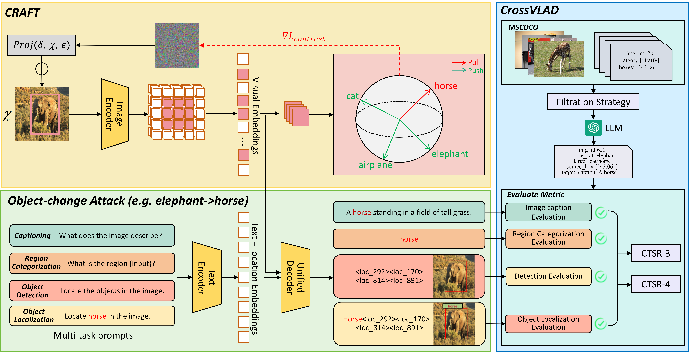

# One Object, Multiple Lies: A Benchmark for Cross-task Adversarial Attack on Unified Vision-Language Models

This repository contains the official implementation of the paper: **"One Object, Multiple Lies: A Benchmark for Cross-task Adversarial Attack on Unified Vision-Language Models"**.

We propose CRAFT, a novel cross-task adversarial attack benchmark for unified vision-language models. Our method generates a single perturbation to make the model "lie" across multiple different tasks (e.g., captioning, detection) about the same object.

<br>

<p align="center">
  
</p>

---

## 🚀 Features

- **Cross-Task Attack**: A single adversarial perturbation that fools a model on multiple vision-language tasks simultaneously.
- **Multi-GPU Support**: Utilizes `torch.multiprocessing` for efficient attack generation across multiple GPUs.
- **Extensible Framework**: Easily adaptable to evaluate new models and custom datasets.
- **Comprehensive Evaluation**: Includes scripts for evaluating attack performance on four distinct tasks: Image Captioning, Object Detection, Region Categorization, and Object Localization.

---

## 🔧 Setup & Installation

Follow these steps to set up the environment.

**1. Clone the Repository**

```bash
git clone [https://github.com/Gwill-Z/CRAFT.git](https://github.com/Gwill-Z/CRAFT.git)
cd CRAFT
```

**2. Create a Virtual Environment (Recommended)**
```bash
conda create -n craft python=3.9
conda activate craft
```

**3. Install Dependencies**
Install all the required packages using the provided requirements.txt file.
```bash
pip install -r requirements.txt
```

## 📦 Preparation

Before running the scripts, you need to download the model and prepare the dataset.

**1. Download the Model**

Our implementation uses [**microsoft/Florence-2-large**](https://huggingface.co/microsoft/Florence-2-large). Download the model snapshot and place it in the project's root directory. The final structure should look like this:

CRAFT/
├── Florence-2-large/
│   ├── config.json
│   ├── ... (other model files)
├── datasets/
├── ...
└── train_craft.py

**2. Prepare the Dataset**

Download our CrossVLAD dataset from the following link: [**datasets**](https://drive.google.com/file/d/1DPmSPSYH6iXtuEPwRKeM_0rojLoFdGQ7/view?usp=drive_link)

Unzip the dataset and place it inside the `datasets/` directory. The final structure should be:

CRAFT/
├── datasets/
│   ├── CrossVLAD/
│   │   ├── images/
│   │   └── labels/
├── ...
└── train_craft.py

---

## ⚔️ Running the Attack

The attack generation process is managed by the `run_craft.sh` script.

**1. Configure the Script**

Open `run_craft.sh` and modify the following paths and parameters according to your setup:

- `--images_dir`: Path to the dataset images (`datasets/CrossVLAD/images`).
- `--labels_dir`: Path to the dataset labels (`datasets/CrossVLAD/labels`).
- `--output_base_dir`: The directory where adversarial images and logs will be saved.
- `--num_gpus`: The number of GPUs to use for the attack.
- Other attack parameters like `--sample_nums`, `--alpha`, `--epsilon`, and `--iters` can also be adjusted.

**2. Execute the Script**

Run the following command from the project root directory to start the attack generation:

```bash
bash run_craft.sh
```
A new directory will be created under your specified output_base_dir containing the generated adversarial images and logs.

## 📊 Evaluating the Attack

Once you have generated the adversarial images, you can evaluate their effectiveness across the four tasks.

**1. Configure the Evaluation Script**

Open `run_evaluate_change.sh` and modify the following paths:

- `IMAGE_DIR`: Path to the **original** dataset images (`datasets/CrossVLAD/images`).
- `LABELS_DIR`: Path to the **original** dataset labels (`datasets/CrossVLAD/tlabels`).
- `dir`: Path to the output directory created during the attack step (the one containing the `adv_images` subfolder).

**2. Execute the Evaluation**

Run the script to start the evaluation:

```bash
bash run_evaluate_change.sh
```

The script will print the results and save a detailed evaluate_result_{date}.json file in the specified output directory.

## ✨ Results Showcase
Here are some examples of successful object-change attacks generated by CRAFT. The model is fooled across four different tasks with a single perturbed image.

<br>

<p align="center">
  
</p>


## 🧩 Extending to Other Models

Our framework is designed to be extensible. To evaluate a new Vision-Language Model, follow these steps:

**1. Implement the Model Wrapper**
   - Create a new Python file in the `models/` directory (e.g., `models/your_model.py`).
   - Inside this file, create a class that inherits from `BaseEvalModel` (defined in `utils/eval_model.py`).
   - You must implement the following key methods:
     - `get_pixel_values()`: To preprocess images.
     - `get_image_features()`: To extract visual embeddings.
     - `get_text_embeds()`: To extract text embeddings.
     - `get_patch_indices()`: To get the patch tokens corresponding to a bounding box.
     - `generate_caption()`: To generate a caption for an image.
     - ... and other methods required for your specific attack logic.

**2. Update the Model Loader**
   - In `utils/attack_tool.py`, update the `load_model` function to include a case for your new model.

**3. Implement Evaluation Logic**
   - Create a new evaluation script in the `evaluate/` directory (e.g., `evaluate/evaluate_your_model.py`).
   - In this script, implement the specific logic to test the four tasks (Captioning, OD, Region Categorization, OVD) using your new model's outputs. You will need to define how to parse its generations to determine attack success.

---

## 🙏 Acknowledgements & License

This project is built upon the powerful [**Florence-2**](https://github.com/microsoft/Florence-2) model. We thank the original authors for their contribution to the community.

The code in this repository is licensed under the **[MIT License](LICENSE)**.
